# 1. VTVPrime — Phân tích Ưu điểm & Nhược điểm dựa trên HCI

**Môn học:** CSC13112 - UI/UX Design
**Giảng viên:** Dr. Lê Khánh Duy
**Nhóm:** [Tên nhóm]

---

## 1.1. Giới thiệu qua về các nguyên tắc HCI

### 1.1.1. Recognition & Recall (Nhận diện & Nhớ lại)

**Recognition** là khả năng người dùng nhận diện được thông tin hoặc chức năng cần thiết khi quan sát giao diện — thông tin được hiển thị sẵn, người dùng chỉ cần nhìn và xác nhận. **Recall** là khả năng nhớ lại thông tin từ trí nhớ dài hạn mà không có manh mối trực quan hỗ trợ. Trong thiết kế giao diện, recognition được coi là hiệu quả hơn recall vì giảm thiểu nỗ lực nhận thức của người dùng.

### 1.1.2. Learnability (Khả năng học)

Learnability đo lường thời gian và nỗ lực cần thiết để người dùng mới có thể sử dụng hệ thống đạt hiệu suất cơ bản mà không mắc lỗi. Đây là một trong năm tiêu chí cốt lõi của Usability theo khung đánh giá của Nielsen.

### 1.1.3. Memorability (Khả năng ghi nhớ)

Memorability là khả năng người dùng có thể tái lập thao tác sử dụng hệ thống sau một khoảng thời gian gián đoạn mà không cần phải học lại từ đầu. Bố cục giao diện tuân theo các khuôn mẫu (pattern) nhất quán và lặp lại sẽ hỗ trợ memorability.

### 1.1.4. Efficiency / Fitts's Law (Hiệu quả)

Fitts's Law là mô hình toán học mô tả mối quan hệ giữa thời gian di chuyển đến mục tiêu với khoảng cách và kích thước của mục tiêu đó:

$$t = a + b \cdot \log_2\left(\frac{d}{s} + 1\right)$$

Trong đó $d$ là khoảng cách từ vị trí hiện tại đến tâm mục tiêu, $s$ là kích thước (chiều rộng) của mục tiêu, $a$ và $b$ là hằng số phụ thuộc ngữ cảnh. Theo công thức này, mục tiêu càng lớn và càng gần thì thời gian tương tác càng ngắn.

### 1.1.5. Error Prevention (Phòng ngừa lỗi)

Error Prevention yêu cầu hệ thống được thiết kế để ngăn chặn lỗi trước khi chúng xảy ra, thay vì chỉ cung cấp cơ chế khắc phục sau khi lỗi đã xảy ra. Biện pháp phòng ngừa bao gồm: đặt các hành động nguy hiểm ở vị trí khó vô tình kích hoạt, yêu cầu xác nhận trước khi thực hiện các thao tác không thể hoàn tác, và cung cấp hướng dẫn trực quan để người dùng thực hiện thao tác đúng ngay từ lần đầu.

### 1.1.6. Accessibility / Inclusive Design (Khả năng tiếp cận & Thiết kế toàn diện)

Accessibility là nguyên tắc đảm bảo giao diện có thể được sử dụng bởi tất cả đối tượng người dùng, bao gồm cả những người có hạn chế về thị giác, thính giác, vận động hoặc nhận thức. Một ví dụ điển hình về yếu tố giúp cải thiện accessibility là **contrast ratio** — tỉ số độ sáng giữa phần tử cần đọc (chữ, icon, hình ảnh) và nền đằng sau nó. Contrast ratio được tính theo công thức W3C dựa trên độ sáng tương đối (relative luminance) của hai lớp màu: lớp foreground (chữ, icon) và lớp background (nền). Thang đo từ 1:1 (foreground và nền trùng màu hoàn toàn, không đọc được) đến 21:1 (đen trắng thuần, tương phản cao nhất). Contrast ratio càng cao thì chữ càng dễ đọc, đặc biệt quan trọng với người dùng khiếm thị nhẹ hoặc người dùng trong điều kiện ánh sáng yếu (ngoài trời nắng, màn hình mờ).

Để đánh giá một giao diện có đạt chuẩn accessibility hay không, các nhà thiết kế dựa vào **WCAG** (Web Content Accessibility Guidelines) — bộ tiêu chuẩn quốc tế do W3C phát hành, quy định các yêu cầu tối thiểu mà giao diện web phải đáp ứng để người dùng khuyết tật có thể truy cập và sử dụng được. Trong đó, yêu cầu về contrast ratio là một trong những tiêu chí quan trọng nhất: ≥ 4.5:1 cho văn bản thông thường và ≥ 3:1 cho văn bản lớn (≥ 18px hoặc ≥ 14px bold). Ngoài ra, WCAG còn yêu cầu tất cả phần tử tương tác phải có tên mô tả cho trình đọc màn hình (screen reader), và cấu trúc heading phải tuân theo thứ tự phân cấp. Khoảng 7–8% nam giới mắc chứng mù màu (color blindness), vì vậy giao diện không nên dựa duy nhất vào màu sắc để truyền tải thông tin.

### 1.1.7. Attention & Cognitive Load (Sự chú ý & Tải nhận thức)

Hệ thống nhận thức của con người xử lý thông tin thông qua ba cơ chế chú ý chính: **Selective attention** (lọc và tập trung vào một nguồn thông tin giữa nhiều nguồn), **Focused attention** (tập trung hoàn toàn vào một đối tượng, loại bỏ mọi yếu tố xung quanh), và **Divided attention** (phân bổ sự chú ý đồng thời cho nhiều nguồn thông tin). Working memory (bộ nhớ ngắn hạn) có dung lượng hạn chế, chỉ lưu giữ được khoảng 7–10 đơn vị thông tin (chunks) tại một thời điểm. Khi giao diện hiển thị quá nhiều thông tin đồng thời, người dùng rơi vào tình trạng cognitive overload (quá tải nhận thức).

### 1.1.8. Reachability & Motor Load (Tầm với & Tải vận động)

Reachability đề cập đến khả năng người dùng có thể chạm tới các phần tử tương tác trên giao diện với nỗ lực vận động tối thiểu. Motor Load là thước đo nỗ lực vận động (di chuyển tay, ngón tay, con trỏ chuột) cần thiết để thực hiện một thao tác.

### 1.1.9. Mental Model & Metaphor (Mô hình tinh thần & Ẩn dụ)

**Mental model** là cấu trúc nhận thức bên trong tâm trí người dùng về cách một hệ thống hoạt động, được hình thành dựa trên kinh nghiệm và trải nghiệm tương tác trước đó. Khi giao diện phù hợp với mental model, người dùng có thể sử dụng hiệu quả mà không cần học lại; khi đi ngược lại mental model, người dùng sẽ gặp khó khăn và phải thử sai. **Metaphor** (ẩn dụ thiết kế) là kỹ thuật vay mượn hình ảnh, biểu tượng hoặc cách tương tác từ các đối tượng quen thuộc trong thế giới vật lý để áp dụng lên các đối tượng trong giao diện số.

### 1.1.10. Consistency (Tính nhất quán)

Consistency gồm hai loại chính: **Internal consistency** (Nhất quán nội bộ) — các phần tử cùng chức năng trong một ứng dụng phải hoạt động và được thể hiện giống nhau ở mọi nơi. **External consistency** (Nhất quán bên ngoài) — giao diện nên tuân theo các tiêu chuẩn và khuôn mẫu phổ biến mà người dùng đã quen thuộc từ các ứng dụng khác trong cùng lĩnh vực. Consistency giúp người dùng chỉ cần học cách tương tác một lần và có thể áp dụng kiến thức đó ở mọi nơi.

### 1.1.11. Affordances & Natural Mapping (Tính gợi ý & Ánh xạ tự nhiên)

**Affordance** (theo Don Norman) là thuộc tính của đối tượng thiết kế gợi ý cho người dùng biết cách sử dụng nó — nút nổi lên trên bề mặt gợi ý thao tác nhấn, thanh trượt gợi ý thao tác kéo. **Natural Mapping** là mối quan hệ tự nhiên và trực giác giữa cơ chế điều khiển (control) và kết quả tác động (effect) — mũi tên bên phải tương ứng với việc di chuyển nội dung sang bên phải, cần lái xe quay trái thì phương tiện rẽ trái.

### 1.1.12. Visibility (Tính hiển thị)

Visibility yêu cầu giao diện phải thể hiện rõ ràng tất cả các chức năng khả dụng và trạng thái hiện tại của hệ thống. Người dùng cần biết được: hệ thống có thể thực hiện những thao tác gì, thao tác nào đang khả dụng tại thời điểm hiện tại, và hệ thống đang ở giai đoạn nào của quy trình xử lý. Thách thức trong thiết kế là cân bằng giữa visibility và simplicity — hiển thị đủ thông tin nhưng giữ giao diện đơn giản.

### 1.1.13. Feedback (Phản hồi)

Feedback là nguyên tắc yêu cầu hệ thống phải cung cấp phản hồi trực quan và rõ ràng sau mỗi hành động của người dùng. Khi người dùng thực hiện một thao tác (nhấn nút, cuộn trang, nhập dữ liệu), hệ thống cần xác nhận rằng thao tác đã được nhận diện và hiển thị kết quả hoặc trạng thái tương ứng. Thiếu feedback dẫn đến tình trạng người dùng không biết hệ thống có đang hoạt động hay không, gây cảm giác bất an và giảm niềm tin vào hệ thống.

## 1.2. Ưu điểm

### 1.2.1. **Ưu điểm 1: Các card được phân thành các carousel có đề mục rõ ràng.**

- **Phân tích**: Thay vì dàn trải toàn bộ các card trên cùng một trang duy nhất, giao diện VTVPrime đã gom nhóm các card vào các carousel, mỗi carousel có một đề mục(heading) mô tả chủ đề chung của các card con. Nhờ đó, thay vì phải cố rắng nhớ(recall) xem các card liên quan đến chủ đề x nằm ở vị trí nào trong trang hoặc card thứ y có chủ đề là gì, thì giờ đây người dùng có thể nhìn tiêu đề của carousel mà các card thuộc về để biết được chủ đề của chúng mà không cần đoán thông qua thumbnail.
- **Nguyên tắc liên quan**: Recognition & Recall.
- **Ví dụ cụ thể**:
  > Người dùng A muốn tìm các show sitcom xả stress. Họ chỉ cần lướt qua các card trong carousel "Sitcom Xả Stress" để tìm kiếm là xong. Không cần phải nhìn qua các card khác trong trang.
  > 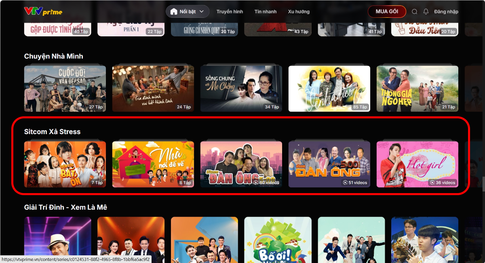

### 1.2.2. **Ưu điểm 2: Lịch phát sóng có hiển thị và sắp xếp theo timeline:**

- **Phân tích**: Khi mở một kênh, lịch phát sóng hiển thị kế bên video đang phát và chứa các thông tin như tên chương trình, thời gian bắt đầu và kết thúc của một chương trình.
- **Nguyên tắc liên quan**: Recognition & Recall.
- **Ví dụ cụ thể**:
  > Người dùng A muốn biết xem kênh họ đang chọn vào lúc 19h00' sẽ phát chương trình nào. Họ chỉ cần liếc mắt qua phải là thấy ngay sắp tới, vào lúc 19h00', sẽ có chương trình thời sự.
  > 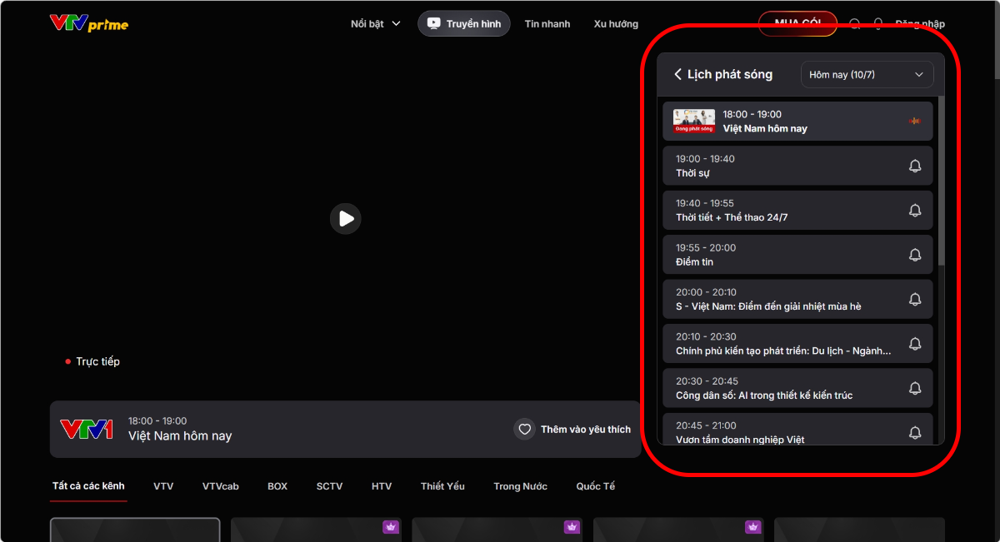

### 1.2.3. **Ưu điểm 3: Pattern giống nhau giữa các carousel**

- **Phân tích:** Các carousel đều dùng chung pattern: Mỗi carousel chứa một heading H2, cạnh bên là nút "Xem tất cả", theo sau là các card có liên quan với nhau, giúp người dùng dễ dự đoán cách tương tác mà không cần học lại. Đây là internal consistency giúp người dùng nhanh chóng hiểu được cấu trúc tổng thể, từ đó dễ dàng khám phá nội dung mới mà không gặp trở ngại.
- **Nguyên tắc liên quan:** Consistency, Memorability.
- **Ví dụ cụ thể:** 
> Người dùng A đang lướt trang web VTVPrime và thấy mục "Phim Hay Không Thể Bỏ Lỡ" có thể cuộn ngang được. Bên trong nó chứa các card đại diện cho các phim mà trang web đề xuất là "Hay". Tiếp theo, A lướt xuống và thấy có mục "Nam Thần Đốn Tim" có cấu trúc tương tự như mục "Phim Hay Không Thể Bỏ Lỡ". Nhờ vậy họ tự khắc suy ra rằng "Trong mục này có nhiều phim, phim nào cũng có những diễn viên điển trai, tôi có thể scroll sang ngang để xem nhiều hơn!".
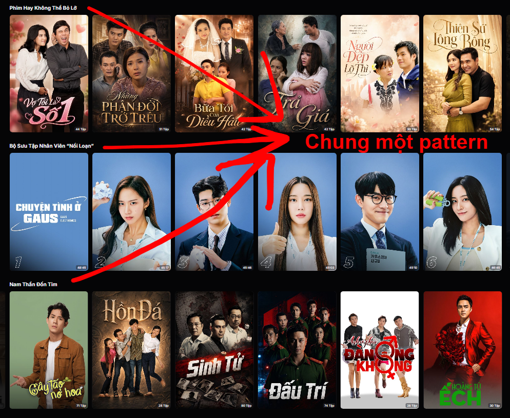

### 1.2.4. **Ưu điểm 4: Các trạng thái "Đang phát", "Sắp phát sóng" được thể hiện rõ ràng**
- **Phân tích:** Ở trạng thái "Đang phát", badge có nền đỏ và trong mô tả của đoạn video .sẽ hiển thị thời gian diễn ra video đó. Ở trạng thái "Sắp phát sóng" thì badge có nền trắng kèm theo thông tin về thời gian phát sóng, ngày phát sóng. Chính vì vậy mà người xem không phải nhớ nhiều về thời gian họ cần chờ đợi để đón xem video. Lỡ như họ có quên mất và bỏ lỡ phần đầu của một video, thanh tiến trình nhỏ dưới mỗi card cũng sẽ cho biết họ có bỏ lỡ phần hay của video hay không(thường là phần giữa của video, bởi vì khúc đầu thường sẽ giới thiệu nhiều hơn). Nếu bỏ lỡ, họ chỉ việc xem lại sau là được.
- **Nguyên tắc liên quan:**  Visibility.
- **Ví dụ cụ thể:** 
> Người dùng A mở VTVprime và thấy chương trình "Genesis Scottish Open | Ngày 2" đang được gắn badge "Đang phát" màu đỏ. Ngoài trạng thái phát trực tiếp, thanh tiến trình bên dưới thẻ nội dung cho biết chương trình đã diễn ra được một phần. Ban đầu, A cũng tò mò muốn xem, nhưng sau khi thấy thanh tiến trình chạy được hơn phân nửa, A quyết định xem sau thay vì loay hoay click vào video, đợi video load xong rồi mới biết video đang ở phút thứ mấy.
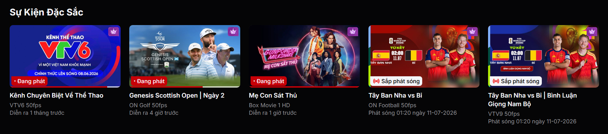

### 1.2.5. **Ưu điểm 5: Nhiều thành phần trong giao diện trang web có sử dụng các "hint" để người dùng biết cách tương tác với trang web sao cho phù hợp.**
- **Phân tích:** Mỗi card trong trang có hiệu ứng hover nhẹ khi di chuột vào, báo hiệu cho người dùng rằng đây là phần tử có thể click được. Nút "Xem tất cả ›" sử dụng ký hiệu mũi tên (›) gợi ý điều hướng sang trang mới. Mũi tên carousel trái/phải gợi ý có thể cuộn ngang để xem thêm nội dung.
- **Nguyên tắc liên quan:** Affordances & Natural Mapping.
- **Ví dụ cụ thể:** 
> Người dùng A từ bé đã thấy ba mẹ của mình lúc chở mình đi học luôn bật xi nhan trái để rẽ trái và bật xi nhan phải để rẽ phải. Dựa vào kinh nghiệm nhiều năm tham gia giao thông như thế, A nhìn vào trang web và biết ngay rằng chỉ cần click vào nút mũi tên phải thì những nội dung bên phải của A sẽ hiện ra, giống hệt như lúc rẽ phải thì sẽ thấy được những khung cảnh ở con đường bên tay phải vậy.

### 1.2.6. **Ưu điểm 6: VTVPrime sử dụng các banner cỡ lớn cho các nội dung quan trọng**

- **Phân tích:** VTVPrime tận dụng metaphor là các banner ở ngoài đường phố để đưa vào trang web của mình, nhấn mạnh những nội dung nổi bật, những nội dung mà họ cho rằng nhiều người dùng sẽ muốn xem. Tính chất chung của banner trong thế giới thật và banner trong trang web là: Chúng đều có kích thước lớn, dễ nhận thấy, hình ảnh thu hút và thông tin súc tích nhưng mang tính kêu gọi sự quan tâm.
- **Nguyên tắc liên quan**: Mental model & Metaphor.
- **Ví dụ cụ thể:**
> Đây là một banner đường phố. Thông điệp "Fashion Never Sleep" tuy ngắn gọn nhưng mang hàm ý kêu gọi mạnh mẽ "Bạn có thể ngủ, nhưng ngủ dậy nhớ cập nhật những trend hot về thời trang!". Cái hay ở đây chính là việc kết hợp giữa khẳng định chắc nịch "NEVER SLEEP" và những tông màu gần màu đỏ(mắt người nhạy hơn đối với những màu trong dải màu đỏ), khiến cho người dùng có cảm giác như họ phải vào trang fashion.com ngay bên dưới để đọc thêm ngay.
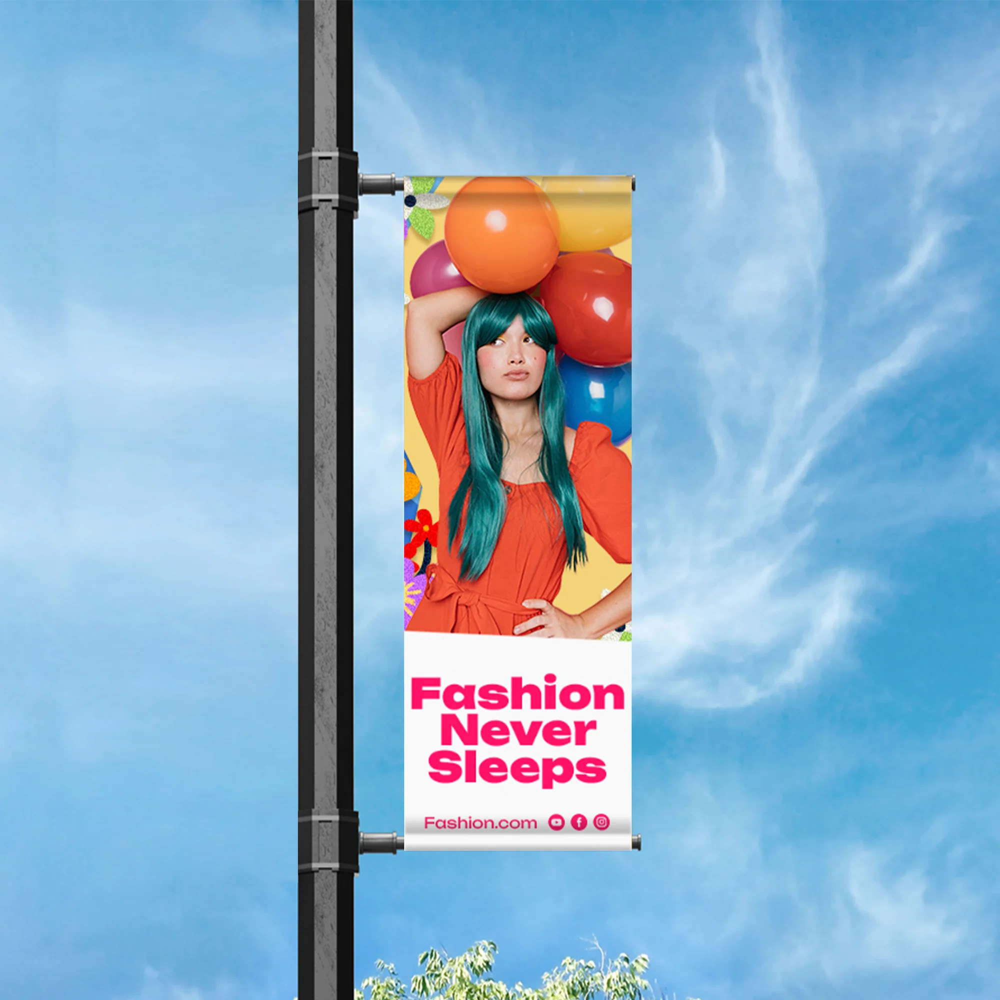

> Đây là một banner trong trang VTVPrime. Cả hình ảnh và nội dung chữ viết trên banner này đều kích thích những ham muốn vật chất của con người: Từ hình ảnh điện thoại, xe,... cho đến dòng chữ tô đỏ "500 triệu đồng", khiến cho người dùng phải tò mò và click vào dòng chữ "Xem ngay" trên banner này.
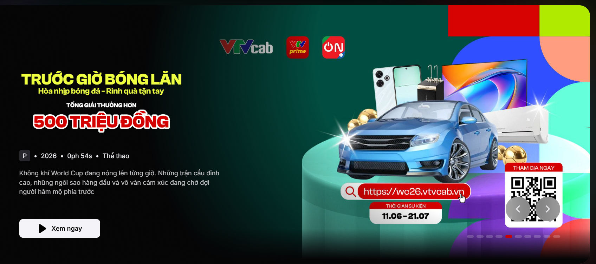

> Đây là một banner khác trong trang. Banner này sử dụng hình ảnh của những người nổi tiếng: Lionel Messi(Hoạt động 22 năm, 500M+ followers trên Instagram), Cristiano Ronaldo(Hoạt động 24 năm, 600M+ followers trên Instagram),... để thu hút lượng fan khổng lồ của họ.
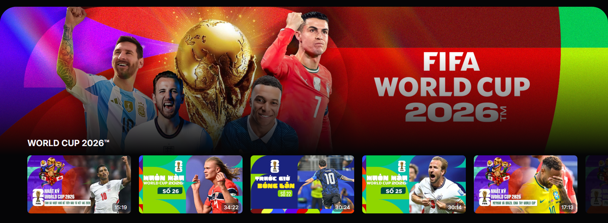

### 1.2.7. **Ưu điểm 7: Sử dụng metaphor "túi đựng tài liệu" cho các phim bộ**
- **Phân tích**: VTVPrime sử dụng các card có dạng nhiều lớp chồng lên nhau như thế một túi đựng tài liệu để nói với người dùng rằng: Trong một card này có nhiều tập phim chứ không phải chỉ là một live video duy nhất. Ngoài ra, số tập cũng được hiển thị ở góc dưới bên phải của mỗi card một cách rõ ràng, không cần phải click vào rồi đếm thủ công từng tập.
- **Nguyên tắc liên quan:** Mental Model & Metaphor, Visibility.
- **Ví dụ cụ thể:** 
> Đây là các card tượng trưng cho phim bộ.
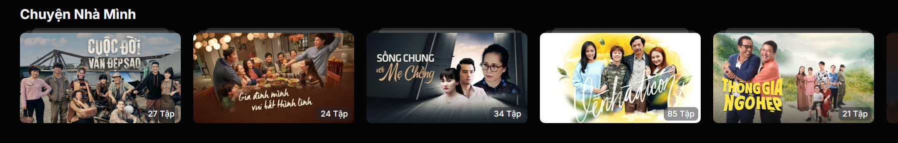

> Mỗi card có nhiều lớp chồng lên nhau.
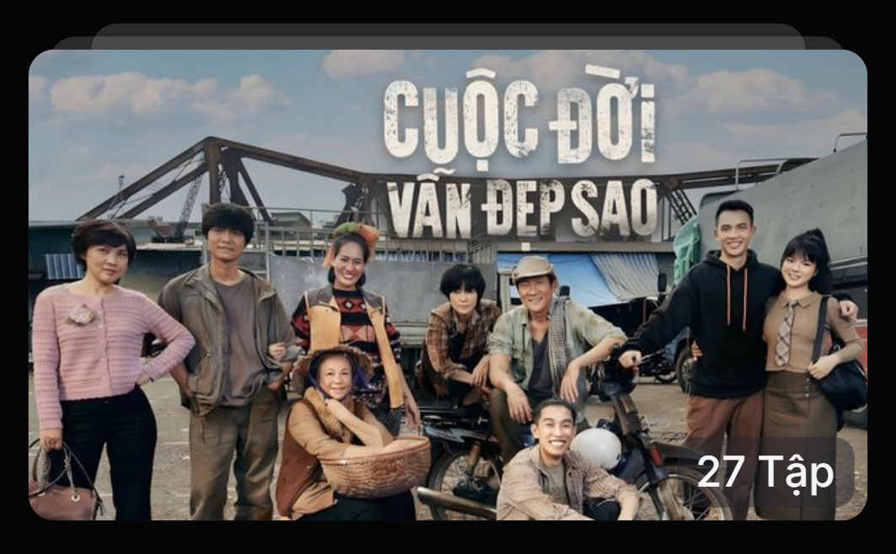

> Không như card của video bình thường.

### 1.2.8. **Ưu điểm 8: Cơ chế cuộn vô tận (infinite scroll) khuyến khích khám phá nội dung**

- **Phân tích HCI:** Trang chủ VTVPrime sử dụng cơ chế infinite scroll — nội dung liên tục được load thêm khi người dùng kéo xuống mà không có điểm dừng cố định. Đối với một nền tảng xem phim/truyền hình, đây là thiết kế phù hợp vì người dùng không cần nhớ rõ từng bộ phim hay chương trình đã xuất hiện, nên việc có nhiều chunk trên cùng một trang cũng không quá ảnh hưởng tới họ. Hơn nữa, cơ chế này khiến người dùng dành nhiều thời gian hơn trên trang web, và trong quá trình lướt, những nội dung nổi bật nhất (banner lớn, thumbnail thu hút, tiêu đề ấn tượng) sẽ được não bộ ghi nhớ. Số lượng nội dung gây ấn tượng với người dùng tăng lên đồng nghĩa với việc thời gian người dùng bỏ ra để xem trang web cũng tăng lên. Khi đó, VTVPrime sẽ trở thành một phần không thể thiếu trong cuộc sống của họ, buộc họ phải gia hạn gói cước mỗi khi hết hạn.
- **Nguyên tắc liên quan:** Attention & Cognitive Load.
- **Ví dụ cụ thể:** Người dùng A mở VTVPrime vào tối thứ Bảy, không có ý định xem gì cụ thể — chỉ muốn "lướt xem có gì hay". Nhờ infinite scroll, A cuộn liên tục qua hàng chục carousel: "Phim Hay Không Thể Bỏ Lỡ", "Nam Thần Đốn Tim", "Sitcom Xả Stress"... Lướt sâu xuống dưới, A tình cờ thấy carousel "Phá Đảo Kỳ Thi Tốt Nghiệp THPT" — nội dung ôn tập kiến thức THPT mà A không hề biết VTVPrime có — nếu trang web dùng pagination, A có lẽ đã dừng lại ở "Trang 1" và không bao giờ biết đến nội dung này. Cuối phiên, A nhớ rõ 2–3 bộ phim nổi bật nhất mà mình đã thấy, và quyết định xem một trong số đó. Nếu dùng pagination, A sẽ thấy ít nội dung hơn trong cùng thời gian, xác suất "tình cờ phát hiện" nội dung mới giảm đáng kể.

## 1.3. Nhược điểm
### 1.3.1. **Nhược điểm 1: Không có tên nội dung hay mô tả ngắn cho nhiều thumbnail**

- **Hiện trạng:** Trong nhiều carousel, mỗi card thumbnail chỉ hiển thị thời lượng video mà không có tên nội dung hoặc mô tả ngắn bên dưới. Người dùng phải click vào, sau đó đợi chuyển trang thì mới biết đó là video gì. Trong khi đó, một vài carousel khác lại làm tốt điều này. Đây là sự thiếu tính nhất quán trên trang web, cũng như thiếu sự thể hiện những thông tin cần thiết.
- **Nguyên tắc liên quan:** Visibility, Consistency.
- **Ví dụ cụ thể:** 
> Người dùng A muốn tìm video highlight trận "Pháp vs Maroc" đã diễn ra. Trong mục "Highlights World Cup 2026™", tất cả card đều hiển thị ảnh thumbnail nhỏ và thời lượng, nhưng không có tiêu đề. Giả sử A không phải là một người xem World Cup thường xuyên. Khi đó, trừ khi A vô tình nhận diện được khuôn mặt của một cầu thủ bất kì nào đó trong một thumbnail nào đó và biết chính xác cầu thủ đó ở đội nào, A phải click vào từng thumbnail một trong carousel cho đến khi thông tin chi tiết lúc chuyển trang có tiêu đề chứa từ khóa "Pháp" và "Ma Rốc". So sánh với YouTube: Cũng thể hiện các thumbnail card, nhưng YouTube hiển thị **title + tên kênh + lượt xem + thời gian đăng tải** bên dưới mỗi thumbnail. Nhờ vậy, người dùng nhận ra ngay nội dung của video là gì, mức độ phổ biến của video như thế nào trước cả khi họ di chuyển con trỏ chuột vào thumbnail của video đó. Ở đây, đội ngũ thiết kế của VTVPrime có sử dụng hình ảnh các lá cờ và tên nước của mỗi đội trong thumbnail. Nhưng lỡ như một ngày nào đó trong tương lai, họ không thiết kế thumbnail theo kiểu đó thì sao?
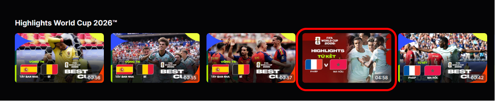

> Sau khi xem xong highlight trận tứ kết giữa Pháp và Ma Rốc, người dùng trở về trang chủ và tiếp tục lướt tiếp trang web. Khi thấy phần thông tin về NSƯT Hoàng Hải, họ sẽ thắc mắc "Tại sao ở chỗ này, tôi có thể thấy rõ tên của các bộ phim, nhưng ở phần highlight World Cup 2026 ban nãy thì tôi lại không thấy?". Người dùng sẽ cảm thấy đôi phần không hài lòng khi chất lượng phục vụ họ trên trang web không ổn định.
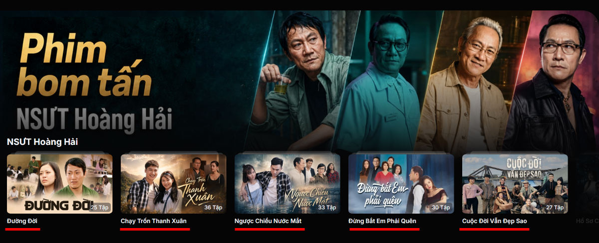

- **Đề xuất hướng khắc phục:** Thêm tiêu đề ngắn bên dưới mỗi thumbnail ("Pháp vs Maroc - Highlight", "Bàn thắng đẹp nhất ngày",...).

### 1.3.2. **Nhược điểm 2: Mũi tên carousel quá nhỏ và đặt sai vị trí — vi phạm Fitts's Law**

- **Phân tích:** Một nguyên tắc quan trọng sinh từ Fitts's Law là screen edge effect: khi mục tiêu nằm ở mép màn hình, chiều rộng hiệu dụng của nó trở nên vô tận vì cursor sẽ dừng lại ở rìa screen — người dùng không cần canh position chính xác, chỉ cần kéo chuột hết cỡ về phía đó là trúng. Đúng lý tưởng, mũi tên carousel nên đặt ở sát mép màn hình (side-edge) với height bằng chiều cao carousel — tạo thành vùng target khổng lồ, dễ click nhất có thể. Tuy nhiên, VTVPrime đặt mũi tên bên trong carousel, có kích thước nhỏ, trên nền tối cùng tông màu nên vừa không tận dụng lợi thế screen edge, vừa thiếu độ tương phản để nhận diện nhanh. Người dùng phải nhìn kỹ rồi di chuột chính xác mới click được — tăng thời gian tương tác.

- **Nguyên tắc liên quan:** Efficiency / Fitts's Law.

- **Ví dụ cụ thể:** 
> Người dùng A muốn cuộn carousel "Nội Dung World Cup 2026™ Mới Nhất" sang phải để xem thêm nội dung. Mũi tên phải nhỏ, nằm bên trong carousel trên nền tối nên bị hòa lẫn vào background, người dùng phải nhìn kỹ rồi di chuột chính xác vào đúng vùng nhỏ đó mới click được. So sánh lý tưởng: mũi tên đặt ở sát mép phải màn hình, có height bao phủ toàn bộ chiều cao carousel → người dùng chỉ cần kéo chuột hết cỡ sang phải là click trúng. Khoảng cách di chuyển (d) giảm đáng kể và kích thước mục tiêu (s) tăng lên gấp nhiều lần nên theo Fitts's Law, thời gian tương tác giảm mạnh.
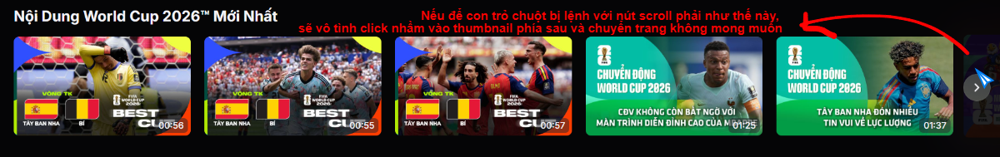

- **Đề xuất hướng khắc phục:** Đặt mũi tên carousel ở sát mép màn hình trái/phải với height bằng chiều cao carousel. Tăng kích thước vùng click để tận dụng lợi thế screen edge effect.

### 1.3.3. **Nhược điểm 3: Thiếu feedback cho infinite scrolling**

- **Phân tích:** Khi cuộn đến cuối cùng của nội dung trên trang chủ, không có dòng text hay dấu hiệu nào cho biết "đã hết nội dung" hoặc "không còn gì để hiển thị". Hệ thống chỉ đơn giản là dừng load — người dùng không biết là do đã hết nội dung thật hay do mạng lag/đang load tiếp. Theo nguyên tắc Feedback, hệ thống cần phản hồi trạng thái sau mỗi hành động của người dùng. Khi thiếu feedback ở trạng thái cuối trang, người dùng rơi vào tình trạng không chắc chắn — không biết nên chờ thêm hay đã hết, dẫn đến hành vi chờ đợi vô ích hoặc tưởng ứng dụng bị lỗi.
- **Nguyên tắc liên quan:** Feedback.
- **Ví dụ cụ thể:** 
> Người dùng cuộn đến cuối trang chủ, trang dừng load. Họ chờ 5-10 giây vì nghĩ mạng chậm, nhưng thực tế không còn gì nữa. Sau vài lần như vậy họ mới hiểu ra, nhưng mỗi lần vẫn phải mất thời gian "đoán" trạng thái hệ thống.
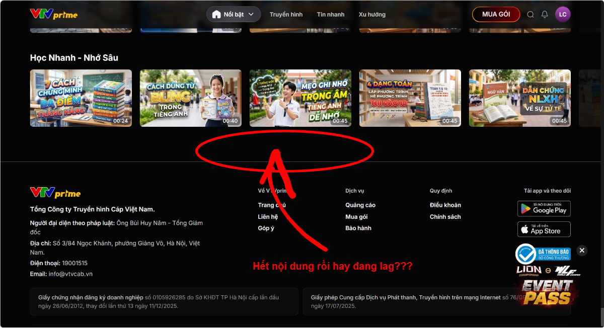
- **Đề xuất hướng khắc phục:** Thêm dòng text như "Đã hiển thị tất cả nội dung".

### 1.3.4. **Nhược điểm 4: Nút "Xem tất cả ›" không nhất quán giữa các section**

- **Phân tích:** Internal consistency yêu cầu các thành phần **cùng chức năng** phải hoạt động giống nhau ở mọi nơi. Các carousel trong trang có chức năng hiển thị một phần thông tin nhưng chỉ một số carousel có nút bấm "Xem tất cả ›" (cho phép xem toàn bộ thông tin), nhiều carousel khác thì không. Điều này phá vỡ pattern recognition: Người dùng học được pattern "heading + Xem tất cả ›" ở carousel đầu tiên. Họ kỳ vọng carousel sau cũng có, nhưng thật ra là không.

- **Nguyên tắc liên quan:** Consistency.

- **Ví dụ cụ thể:** 
> Người dùng A thấy carousel "World Cup 2026™" có nút "Xem tất cả ›" bên phải, họ click vào và xem được toàn bộ danh sách các video. Tiếp tục lướt xuống, A thấy section "Muôn Màu World Cup" cũng là carousel tương tự, kỳ vọng sẽ có "Xem tất cả ›" nhưng không có. A thắc mắc: *"Tại sao section này không có? Vậy mình phải làm sao để xem tất cả các nội dung đây? Chẳng lẽ mình phải lướt hết carousel? Lỡ như carousel này dài quá thì sao? Mình sẽ tốn bao nhiêu thời gian để lướt hết carousel này? Mình có nên lướt tiếp không?..."* → mất thời gian tìm kiếm và bị bỡ ngỡ.
> "World Cup 2026™" có nút "Xem tất cả".
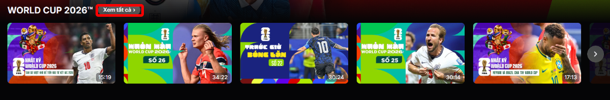
> "Muôn Màu World Cup" không có nút này.
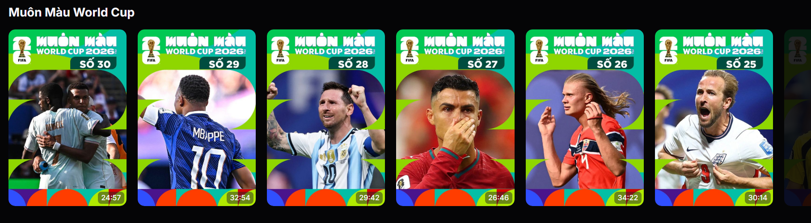

### 1.3.5. **Nhược điểm 5: Nhiều ảnh bị để trống alt text — vi phạm Accessibility**

- **Phân tích HCI:** Tất cả ảnh trên trang web nên có alt text — thuộc tính mô tả nội dung ảnh cho phần mềm đọc màn hình (screen reader) của người khiếm thị. Khi ảnh để trống alt text, screen reader sẽ bỏ qua hoàn toàn, người dùng khiếm thị không biết ảnh đó chụp gì. Trên trang chủ VTVPrime, có nhiều ảnh bị để trống alt text hoặc có nhưng vô dụng(Ví dụ: alt="poster"). Đặc biệt quan trọng với các ảnh thumbnail phim/program vì đây là nội dung chính mà người dùng cần nhận diện để quyết định xem hay không.

- **Nguyên tắc liên quan:** Accessibility / Inclusive Design.

- **Ví dụ cụ thể:** 
> Một người khiếm thị sử dụng phần mềm đọc màn hình truy cập VTVPrime. Khi cuộn qua các carousel, screen reader đọc: "heading: Phim Hay Không Thể Bỏ Lỡ. image. image. image. heading: Nam Thần Đốn Tim. image. image. image..." — người dùng nghe toàn là "image" mà không biết ảnh nào chụp phim gì, vì alt text bị bỏ trống. Nếu alt text được điền đúng (vd: alt="Poster phim Thỏ Peter - 10 tập, thể loại phiêu lưu"), screen reader sẽ đọc: "image: Poster phim Thỏ Peter - 10 tập, thể loại phiêu lưu" → người dùng biết ngay nội dung mà không cần click vào.

- **Đề xuất hướng khắc phục:** Thêm alt text có nghĩa cho tất cả 16 ảnh đang để trống trên trang chủ. Alt text nên mô tả ngắn gọn nội dung ảnh, ví dụ: alt="Poster phim Thỏ Peter", alt="Highlight trận Pháp vs Maroc - World Cup 2026". Không dùng alt text chung chung như alt="image" hoặc alt="photo".

### 1.3.6. **Nhược điểm 6: Nút "Xem tất cả" quá nhỏ và nằm xa vùng tương tác của người dùng**
- **Phân tích:** Nút "Xem tất cả" nhỏ, lại luôn show mỗi lần rê chuột vào một card bất kì. Với trường hợp người dùng đang rê chuột vào các card ở phía cuối, khoảng cách d từ card đến nút "Xem tất cả" sẽ lớn hơn. Hơn nữa, khi rê chuột ở vị trí cuối, thường là người dùng đang ở trong tâm thế muốn hiện thêm kết quả, vì vậy tần suất họ muốn click vào nút "Xem tất cả" sẽ tăng. Số lần click tăng và thời gian tương tác cũng tăng sẽ gây ra độ trễ tích lũy khổng lồ đối với hành vi của người dùng.
- **Nguyên tắc liên quan:** Efficiency / Fitts' Law.
- **Giải pháp đề xuất:** Nhóm nghĩ ra hai giải pháp. Một là đẩy nút "Xem tất cả" vào giữa và kéo dài nút ra. Hai là đưa các header vào một khung chứa, có background color và có thể click được. Khi đó, khoảng cách từ mỗi card đến vị trí cần click để xem tất cả kết quả là như nhau và cũng chính là khoảng cách nhỏ nhất.
- **Ví dụ cụ thể:**
> Người dùng A muốn xem tất cả những video liên quan đến WORLD CUP 2026 khi họ đang rê chuột đến video cuối cùng trong carousel. Con chuột của họ đang bị hư, họ phải dùng touchpad trên laptop và ngón tay của họ cũng bị trày xước nhẹ khiến cho việc di chuyển ngón tay trên touchpad cũng hơi khó khăn. Họ thấy nút "Xem tất cả" nằm tuốt ở phía bên trái và tuy không thích nhưng vẫn phải chấp nhận việc rê con trỏ chuột đến nút ấy chỉ để phát hiện ra rằng trong danh sách đầy đủ cũng không chứa nội dung nội dung họ quan tâm. Họ cảm thấy khó chịu trong lòng.
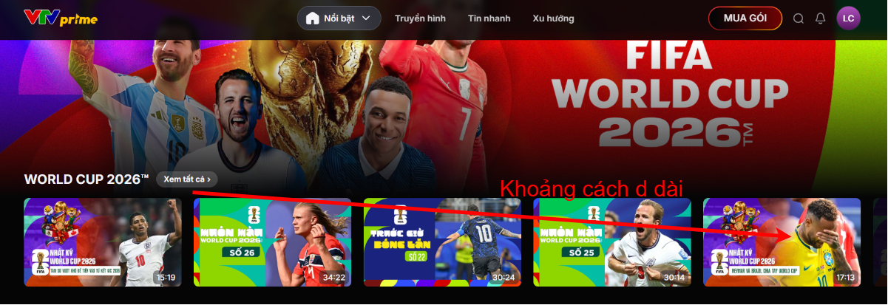

### 1.3.7. **Nhược điểm 7: Định dạng card phim bộ không nhất quán giữa các carousel**
- **Phân tích HCI:** Đều là phim bộ nhưng VTVPrime sử dụng hai định dạng card khác nhau: phần lớn carousel dùng card **nằm ngang** với metaphor "túi đựng tài liệu" (nhiều lớp chồng lên nhau), nhưng một số carousel khác lại dùng card **dọc** mà không có metaphor này. Theo nguyên tắc **Internal Consistency**, cùng một loại nội dung (phim bộ) nên có cùng một format trình bày để người dùng nhận ra ngay mà không cần suy luận. Khi định dạng thay đổi đột ngột giữa các carousel, mental model của người dùng bị phá vỡ — họ đã quen với pattern "phim bộ = card ngang layers" ở carousel trước, nhưng carousel sau lại dùng card dọc → phải học lại pattern mới.
- **Nguyên tắc liên quan:** Consistency (Internal Consistency), Mental Model.
- **Ví dụ cụ thể:** 
> Mục "VTVprime Đề Xuất" chứa các card phim bộ nằm ngang với nhiều lớp chồng lên nhau (metaphor "túi đựng tài liệu") → người dùng hiểu "đây là phim bộ". Nhưng khi cuộn xuống mục "Phim Hay Không Thể Bỏ Lỡ" — cũng là phim bộ — lại dùng định dạng card dọc, không có layers → người dùng phải dừng lại nhận diện lại format, mất thời gian thích nghi.
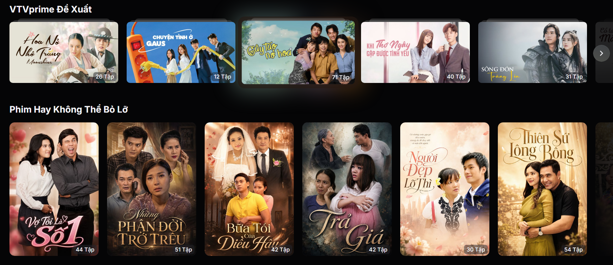

### 1.3.8. **Nhược điểm 8: Nút "Mua gói" đặt sai vị trí và thiếu feedback sau khi mua**
- **Phân tích:** "Mua gói" tuy không phải là một chức năng được sử dụng thường xuyên(người dùng chỉ thanh toán 1 lần cho 1 tuần, 30 ngày,...) nhưng nút bấm này được gom nhóm để nằm sát bên cạnh nút tìm kiếm(một tính năng được dùng thường xuyên). Thậm chí, nút "Mua gói" còn to hơn nút tìm kiếm, có màu sắc nổi bật hơn nút tìm kiếm. Ngay cả khi đã mua gói, nút "Mua gói" vẫn không biến mất hoặc đổi trạng thái mà vẫn hiển thị ở đó như chưa có gì xảy ra.
- **Nguyên tắc liên quan:** Attention, Feedback.
- **Ví dụ cụ thể:** 
> Sau khi người dùng A đăng ký mua gói "Prime" trong giao diện mua gói, hệ thống trả về trang chủ. Tuy nhiên, giao diện hầu như không thay đổi, không có phản hồi gì mới, icon của user vẫn giữ nguyên như thể chưa có chuyện gì xảy ra.
> Trước và sau khi mua gói đều không đổi:
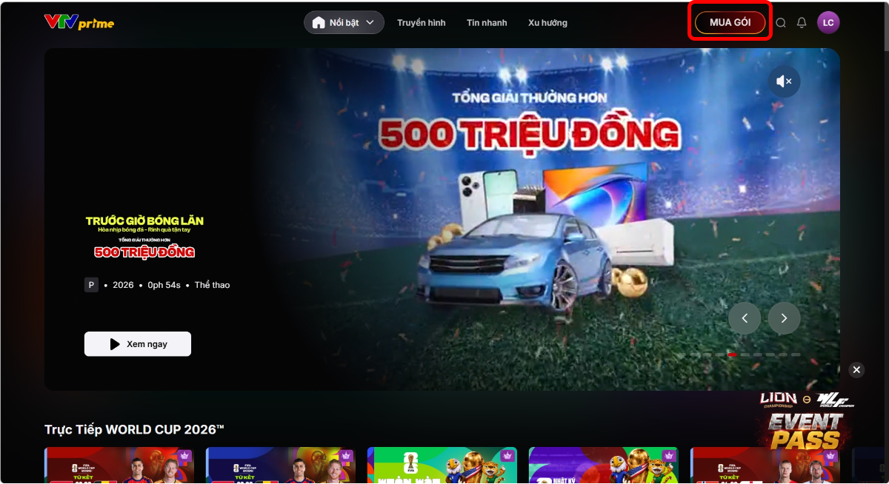

### 1.3.9. **Nhược điểm 9: Giao diện trang mua gói gây nhầm lẫn giữa các gói cước**

- **Phân tích:** Có 4 loại gói cước trong trang "Mua gói" của VTVPrime: LION vs WLF, World Cup, Prime, Vinaphone. Nhưng giao diện đăng ký gói cước khiến cho người dùng cảm thấy khó hiểu. Cùng phân tích một số ví dụ bên dưới để làm rõ điều này.
- **Nguyên tắc liên quan**: Visibility, Learnability, Error Prevention.
- **Ví dụ cụ thể**:
> Người dùng A đăng ký mua gói cước Prime thành công với số lượng kênh là 100+ theo như khẳng định trên trang web.
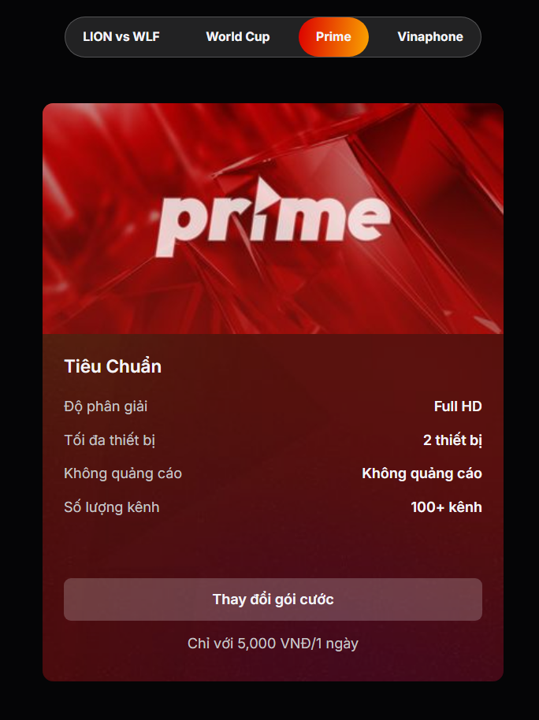

> Một khoảng thời gian sau, A vì muốn đăng ký cộng dồn thời lượng sử dụng của cùng gói cước Prime nên A lại truy cập vào trang mua gói. Lúc này, mặc định trang web sẽ hiển thị thông tin của gói đầu tiên từ bên trái - gói LION vs WLF. Tuy nhiên, lúc này vấn đề xuất hiện. A thấy giao diện gói LION vs WLF có nút "**Nâng cấp** trải nghiệm" trong khi quyền lợi ít hơn(chỉ có kênh chiếu "3 trận LION vs WLF + 7 trận LC33 diễn ra ngày 11/7/2026"). A sẽ thắc mắc "Tại sao số kênh ít hơn gói hiện tại của mình nhưng lại có nút NÂNG CẤP nhỉ? Vậy là gói này sẽ chứa 100+ kênh trong gói hiện tại của mình VÀ những kênh chiếu các trận đấu diễn ra vào ngày 11/7/2026 hay là chỉ chứa các kênh chiếu các trận đấu này thôi? Nếu cũng là gói 100+ kênh thì tại sao giá lại rẻ hơn? Không lẽ gói này đang giảm giá cho đến ngày 11/7? Mình có nên mua ngay để được cộng dồn thời hạn sử dụng với mức giá rẻ hơn hay không? Mà lỡ không như mình nghĩ, mua gói này xong thì gói kia sẽ bị hủy thì sao?..." Chỉ cần một suy đoán sai lầm, A sẽ bị mất tiền oan. Giao diện này cực kì không minh bạch đối với một giao diện có liên quan đến vấn đề tiền bạc.
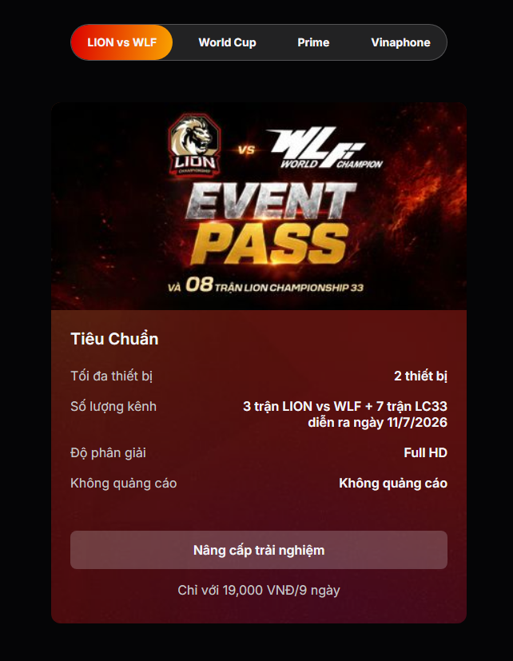

### 1.3.10. **Nhược điểm 10: Lịch phát sóng có ký tự `<` vô dụng và các mục đều có dạng nút bấm gây lỗi**

- **Phân tích:** (1) **Ký tự `<` đặt trước tiêu đề "Lịch phát sóng"** nhưng nó không có chức năng gì khi click vào. Trong giao diện web, ký tự `<` thường được dùng làm nút "quay lại trang trước" (back button) — người dùng đã quen với mental model này. Khi thấy `<` trước "Lịch phát sóng", người dùng sẽ kỳ vọng click vào sẽ quay lại trang trước hoặc thu gọn danh sách lịch phát sóng, nhưng thực tế nó không hoạt động → gây **false affordance**: gợi ý một chức năng không tồn tại. (2) **Tất cả mục trong lịch phát sóng đều có dạng giống nút bấm** — cùng format, cùng cursor pointer khi hover — chương trình đã phát, đang phát và chưa phát đều trông giống hệt nhau. Theo nguyên tắc **Error Prevention**, giao diện nên ngăn chặn lỗi trước khi xảy ra — nhưng ở đây, người dùng dễ dàng click vào chương trình chưa phát (vì nhìn giống nút bấm) và chỉ nhận được thông báo lỗi. Chương trình chưa phát nên có format khác (Ví dụ: mờ hơn, không có cursor pointer,...) để người dùng biết rằng không thể tương tác.

- **Nguyên tắc liên quan:** Visibility, Error Prevention.

- **Ví dụ cụ thể:** 
> Người dùng A mở kênh VTV1 vào lúc 15h55. Họ thấy lịch phát sóng với các mục: "15:40 - Thương hiệu quốc gia Việt Nam" (đã phát), "15:55 - Về quê: Liên kết bền vững..." (đang phát), "16:00 - Thời sự" (chưa phát). Tất cả đều có cursor pointer. A tò mò click vào "Thời sự" lúc 16h00 vì nghĩ có thể xem trước nội dung → hệ thống báo lỗi. Nếu giao diện phân biệt rõ ràng giữa "có thể click" và "chưa thể click", người dùng sẽ không gặp lỗi này.
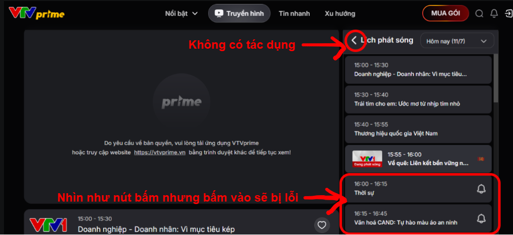

### 1.3.11. **Nhược điểm 11: Nút hamburger và nút đóng sidebar trên tablet đặt sai vị trí**

- **Phân tích HCI:** Trên giao diện tablet, nút hamburger (☰) nằm ở sát bên trái navbar — vị trí này hợp lý. Tuy nhiên, khi bấm vào hamburger thì sidebar mở rộng full màn hình, và nút × (đóng) lại nằm ở **sát bên phải** màn hình → khoảng cách di chuyển từ nút hamburger (bên trái) đến nút × (bên phải) rất lớn, buộc người dùng phải di chuyển ngón tay một quãng dài trên tablet — tăng motor load đáng kể. Theo nguyên tắc **Reachability & Motor Load**, các phần tử tương tác thường xuyên nên được đặt ở vị trí dễ chạm tới với nỗ lực vận động tối thiểu.

- **Nguyên tắc liên quan:** Reachability & Motor Load.

- **Ví dụ cụ thể:** 
> Người dùng A đang dùng tablet, muốn truy cập hamburger menu để điều hướng sang trang "Tin nhanh". A dùng ngón tay bấm nút hamburger ở góc trên bên trái → sidebar mở full màn hình. Để đóng sidebar, A phải với tay sang tận góc trên bên phải để bấm nút × → mất thời gian và bất tiện, đặc biệt với tablet màn hình lớn. Nếu nút × nằm ở vị trí hợp lý hơn (gần nút hamburger hoặc ở mép trái sidebar), thao tác sẽ nhanh hơn rất nhiều.
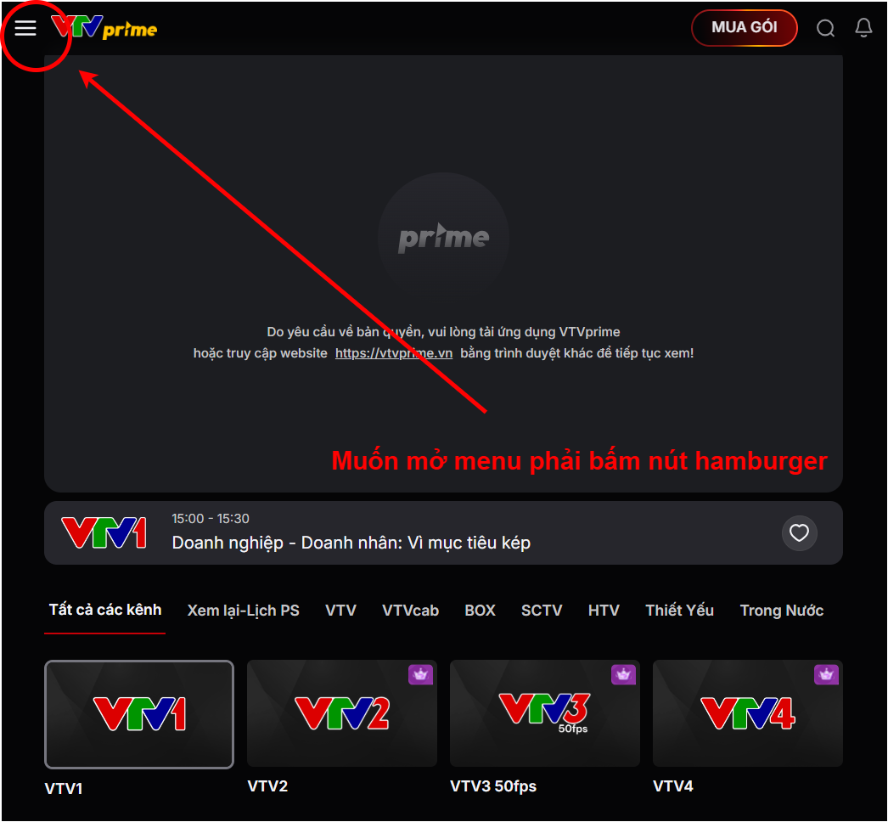
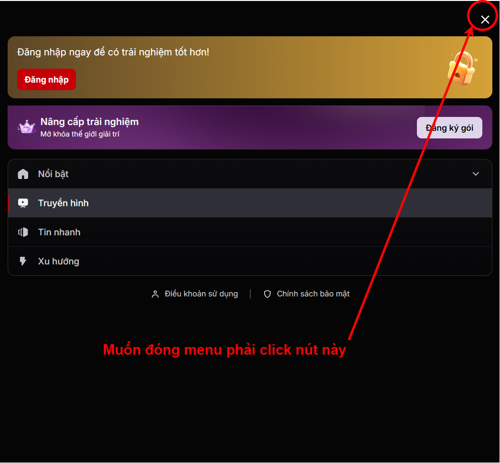

- **Đề xuất hướng khắc phục:** (1) Thu nhỏ sidebar lại, không mở rộng full màn hình và làm mờ nội dung ở lớp dưới sidebar, có thể bấm ra ngoài để đóng. (2) Đặt nút × ở sát bên trái sidebar (gần vị trí nút hamburger) thay vì bên phải để giảm khoảng cách di chuyển.
